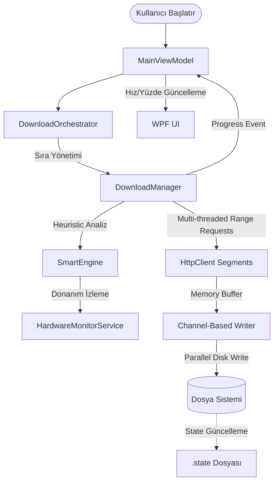

# 🏗️ BoltFetch Sistem Mimarisi ve İş Mantığı Dokümantasyonu

Bu doküman, BoltFetch (KDownloader) projesinin teknik mimarisini, indirme motorunun çalışma prensiplerini ve akıllı optimizasyon mekanizmalarını detaylandırmaktadır.

---

## 1. 🗺️ Proje Haritası (Navigation Map)
*Projedeki dosyaların görev dağılımı:*

*   **`Core/`**: Temel veri modelleri, ortak arayüzler ve uygulama çapında kullanılan sabitler. Sistemin "iskeletini" oluşturur.
*   **`Services/`**: İş mantığının (Business Logic) kalbi.
    *   `DownloadManager.cs`: İndirme işleminin asıl operatörü.
    *   `SmartEngine.cs`: Dosya kategorizasyonu ve performans optimizasyonu.
    *   `DownloadOrchestrator.cs`: Kuyruk yönetimi ve paralel indirme planlayıcısı.
*   **`UI/`**: WPF View'ları (`.xaml`) ve ilgili UI mantığı. Proje MVVM paternini kullanır.
*   **`ViewModels/`**: UI ile iş mantığı arasındaki köprü. `CommunityToolkit.Mvvm` kullanarak veri bağlama (binding) işlemlerini yönetir.
*   **`Models/`**: `GoFileItem`, `UserSettings` ve performans için özelleştirilmiş `BulkObservableCollection` gibi veri yapıları.

---

## 2. 🧠 Kritik Business Logic (Nasıl Çalışıyor?)

### A. İndirme Algoritması (The Download Engine)
*   **Chunking (Parçalama):** Büyük dosyalar 4MB'lık (`CHUNK_SIZE`) parçalara bölünür. `DownloadManager`, sunucunun `HTTP Range` isteklerini destekleyip desteklemediğini kontrol eder. Destek varsa, dosyayı eş zamanlı segmentler halinde indirerek hızı maksimize eder.
*   **Concurrency & Throttling:** 
    *   `SemaphoreSlim` kullanılarak global paralel indirme limiti uygulanır.
    *   Her dosya kendi içinde `SegmentsPerFile` kadar paralel thread açar.
    *   `ThrottleInstant` metodu, mikrosaniyelik gecikmeler (`Task.Delay`) ekleyerek kullanıcının belirlediği hız limitini anlık olarak korur.
*   **Turbo Booster (Async Write Channel):** Ağdan gelen veriler doğrudan diske yazılmaz. `System.Threading.Channels` kullanılarak bir tampon (buffer) arkasına alınır. Bu, ağ trafiği ile disk yazma (I/O) gecikmelerini birbirinden ayırarak performans düşüşünü engeller.
*   **Retry Policy:** Ağ hatalarında veya `429 Too Many Requests` durumlarında, 2 saniyeden başlayan üstel geri çekilme (`Exponential Backoff`) ile 5 seferlik bir otomatik tekrar mekanizması çalışır.

### B. Veri Akışı ve State Yönetimi
*   **Anlık Progress:** İndirme motoru `ProgressChanged` event'i fırlatır. ViewModel bu event'i dinleyerek `FileDisplayItem.ProgressValue` özelliğini günceller.
*   **Resumption (Kaldığı Yerden Devam):** Her 5 blok tamamlandığında `SegmentStateTracker` üzerinden bir `.state` dosyası güncellenir. Olası bir crash durumunda uygulama, bu dosyayı okuyarak hangi parçaların indiğini bilir ve sadece eksik olanları talep eder.
*   **CancellationToken:** Uygulama genelinde `LinkedTokenSource` yapısı kullanılır. Kullanıcı bir indirmeyi durdurduğunda veya uygulamayı kapattığında tüm ağ bağlantıları ve disk yazma işlemleri "graceful" bir şekilde sonlandırılır.

---

## 3. 🔌 Servisler ve Bağımlılıklar
*   **`DownloadManager.cs`**: `IDownloadManager` arayüzünü uygular. Ağ iletişimi, bellek yönetimi (`ArrayPool`) ve dosya birleştirme işlemlerinden sorumludur.
*   **`SmartEngine.cs`**: Karar verme mekanizmasıdır.
    *   Hangi dosyanın (video, oyun, arşiv) hangi klasöre gideceğini belirler.
    *   Gecmiş indirme hızlarını analiz ederek hangi sunucu için kaç segmentin (`GetOptimalSegments`) en iyi hızı verdiğini "öğrenir".
*   **`HardwareMonitorService.cs`**: Sistemin anlık CPU ve RAM yükünü izler. Eğer donanım darboğazı sezerse indirme segmetlerini veya paralel görev sayısını düşürerek bilgisayarın donmasını engeller.

---

## 4. 📊 Görselleştirme (Mermaid.js Diyagramı)

> [!NOTE]
> Bu doküman, gelecekteki bir yapay zeka ajanının projeyi saniyeler içinde anlayabilmesi için "Business Logic" odaklı hazırlanmıştır.
